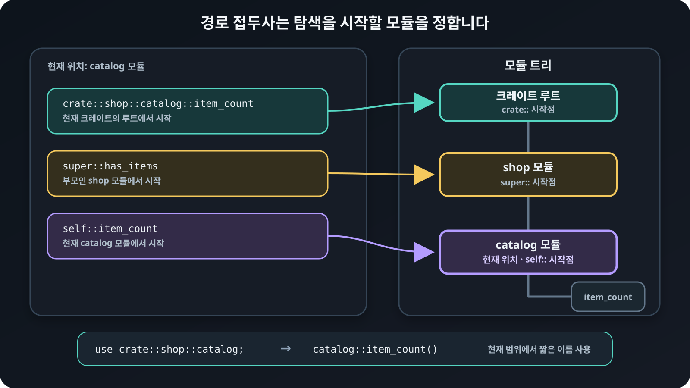

# 경로와 `use`

경로<sub>path</sub>는 모듈 트리에서 항목의 위치를 나타냅니다. 절대
경로<sub>absolute path</sub>는 크레이트 루트<sub>crate root</sub>에서 시작하고,
상대 경로<sub>relative path</sub>는 현재 위치를 기준으로 시작합니다.

`crate::`로 시작하면 현재 크레이트 루트에서 찾습니다. `self::`는 현재
모듈<sub>module</sub>, `super::`는 부모 모듈에서 시작합니다.

## 같은 항목을 절대 경로와 상대 경로로 찾기

크레이트 루트에 있는 `main` 함수에서는 다음 두 경로가 같은 `item_count` 함수를
가리킵니다.

```rust
{{#include ../../../examples/02_paths.rs:path_module_open}}
{{#include ../../../examples/02_paths.rs:item_count}}
{{#include ../../../examples/02_paths.rs:catalog_close}}
{{#include ../../../examples/02_paths.rs:shop_close}}

{{#include ../../../examples/02_paths.rs:main_open}}
{{#include ../../../examples/02_paths.rs:root_paths}}
{{#include ../../../examples/02_paths.rs:main_close}}
```

`crate::shop::catalog::item_count`는 크레이트 루트에서 시작하는 절대 경로입니다.
`shop::catalog::item_count`는 현재 위치인 크레이트 루트에서 `shop`을 찾는 상대
경로입니다. 현재 위치가 크레이트 루트라서 두 경로의 모양이 비슷하지만, 중첩된
모듈 안에서는 상대 경로의 시작점이 달라집니다.

## 중첩 모듈에서 경로의 시작점 바꾸기

다음 코드는 `shop` 모듈 안에 `catalog` 모듈을 선언하고, 경로를 사용하는 함수가
어느 모듈에 놓였는지 함께 보여줍니다.

```rust
{{#include ../../../examples/02_paths.rs:path_module_open}}
{{#include ../../../examples/02_paths.rs:path_starts}}
{{#include ../../../examples/02_paths.rs:path_module_close}}
```

- ① `crate::shop::catalog::item_count()`는 현재 위치와 관계없이 크레이트 루트부터
  전체 경로를 따라갑니다.
- ② `self::item_count()`는 현재 `catalog` 모듈에서 `item_count`를 찾습니다.
- ③ `super::has_items()`는 부모인 `shop` 모듈에서 `has_items`를 찾습니다.

## 경로의 시작점 비교하기

<figure>
  
  <figcaption><code>crate::</code>, <code>super::</code>, <code>self::</code>는 같은 모듈 트리에서 탐색을 시작할 위치를 정합니다.</figcaption>
</figure>

## `use`로 경로 줄이기

`use`는 항목을 현재 범위에 짧은 이름으로 가져옵니다.

```rust
{{#include ../../../examples/02_paths.rs:imports}}
```

`use crate::shop::catalog;`는 모듈 이름을 가져오므로 함수는
`catalog::item_count()`로 호출합니다. `use crate::shop::catalog::Item;`은 모듈
안의 타입을 직접 가져오므로 전체 경로 대신 `Item::new()`라고 쓸 수 있습니다.

함수는 어느 모듈에서 왔는지 드러나도록 부모 모듈을 가져오는 경우가 많고,
구조체나 열거형 같은 타입은 타입 이름을 직접 가져오는 경우가 많습니다. 반드시
따라야 하는 문법 규칙은 아니며, 같은 이름이 겹치지 않고 코드를 읽기 쉬운 방식을
고르면 됩니다.

## `as`로 같은 이름 구분하기

서로 다른 모듈에 같은 이름이 있다면 부모 모듈 이름을 함께 사용하거나 `as`로
별칭<sub>alias</sub>을 붙입니다. 다음 두 모듈에는 이름이 같은 `item_count` 함수가
있습니다.

```rust
{{#include ../../../examples/02_paths.rs:aliases}}
```

`as online_item_count`는 가져온 함수가 현재 범위에서 쓰일 이름을 정합니다. 원래
함수의 이름이나 모듈 안의 경로가 바뀌는 것은 아닙니다. 무조건 가장 짧은 이름보다
출처를 알아보기 쉬운 이름을 붙이는 편이 좋습니다.

## 외부 패키지를 의존성으로 추가하기

다른 패키지의 라이브러리를 사용하려면 먼저 그 패키지를 현재 패키지의 의존성으로
추가해야 합니다. 다음 명령은 `serde_json` 패키지를 추가합니다.

```bash
cargo add serde_json
```

명령을 실행하면 `Cargo.toml`의 `[dependencies]`에 다음 항목이 생깁니다.

```toml
{{#include ../../../Cargo.toml:external_dependency}}
```

`use`는 이미 연결된 크레이트의 항목을 현재 범위로 가져오는 문법입니다. `use`만
작성한다고 외부 패키지를 내려받거나 의존성에 추가하지는 않습니다. 카고는
`Cargo.toml`을 읽어 필요한 패키지를 내려받고 함께 빌드합니다.

## `crates.io`란?

[`crates.io`](https://crates.io/)는 Rust 공동체가 패키지를 공개하고 내려받는
공식 패키지 저장소입니다. `cargo add serde_json`처럼 별도 저장소를 지정하지 않고
의존성을 추가하면 카고는 기본적으로 이 저장소에서 패키지를 찾습니다. 직접 필요한
패키지뿐 아니라 그 패키지가 의존하는 다른 패키지도 함께 내려받습니다.

이름에 `crates`가 들어가지만, `crates.io` 자체는 프로젝트를 구성하는 크레이트가
아닙니다. `crates.io`에 배포하는 단위는 패키지이며, 그 패키지에는 라이브러리
크레이트나 실행 파일 크레이트가 들어갈 수 있습니다. `cargo publish`는 현재
패키지를 배포하고, `cargo add`는 다른 패키지를 의존성으로 추가합니다.

## 외부 크레이트의 항목을 `use`로 가져오기

의존성 패키지가 제공하는 라이브러리 크레이트는 코드에서 크레이트 이름으로
접근합니다. 다음 코드는 `serde_json` 크레이트의 `Value` 타입과 `json` 매크로를
가져옵니다.

```rust
{{#include ../../../examples/02_paths.rs:external_imports}}
```

외부 크레이트의 경로는 `crate::`가 아니라 크레이트 이름인 `serde_json`으로
시작합니다. `Value`와 `json`을 현재 범위로 가져왔으므로 이후에는 전체 경로를
반복하지 않고 짧은 이름으로 사용할 수 있습니다.

```rust
{{#include ../../../examples/02_paths.rs:external_use}}
```

여기서 `serde_json` 패키지는 의존성을 배포하고 관리하는 단위이고, Rust 코드의
`serde_json`은 그 패키지가 제공하는 라이브러리 크레이트 이름입니다. 두 이름은
대개 같지만 항상 같아야 하는 것은 아닙니다. 현대 Rust에서는 의존성을
`Cargo.toml`에 추가하면 크레이트 이름을 바로 경로에 쓸 수 있으므로 예전 문법인
`extern crate`는 보통 작성하지 않습니다.
