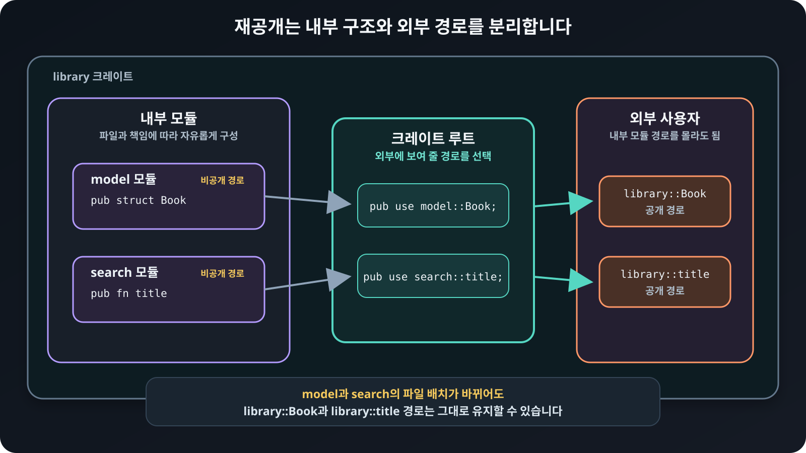

# 재공개로 API 구성하기

`pub use`는 다른 경로의 공개 항목을 현재 경로에서 다시 공개합니다. 이를
재공개<sub>re-export</sub>라고 합니다.

```rust
{{#include ../../../examples/04_reexports.rs:reexport}}
```

예제 내부에서는 `model::Book`과 `search::title`로 나누어 두었지만, `main`에서는
`library::Book`과 `library::title`처럼 짧은 경로를 사용합니다. 라이브러리
크레이트<sub>crate</sub>의 루트에서 같은 방식으로 재공개하면 외부 사용자는 내부
모듈 경로를 거치지 않고 크레이트 이름 바로 아래에서 항목을 가져올 수 있습니다.

## 내부 구조와 외부 경로 분리하기

<figure>
  
  <figcaption>크레이트 루트는 내부에서 필요한 항목을 골라 외부 사용자가 볼 공개 경로를 구성합니다.</figcaption>
</figure>

재공개는 단순한 편의 문법이 아닙니다. 내부 파일 배치를 바꾸더라도 공개 경로를
유지할 수 있게 합니다. 다만 관련 없는 항목을 크레이트 루트에 모두 모으면 이름의
뜻과 소속을 알기 어려워지므로, 사용자가 자주 함께 쓰는 API를 중심으로
구성합니다.
