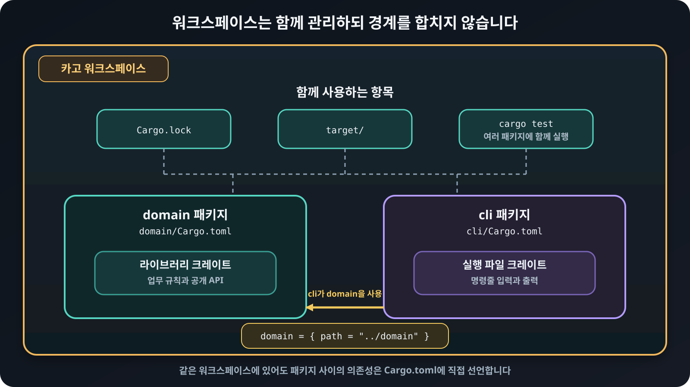

# 워크스페이스와 크레이트 경계

카고<sub>Cargo</sub> 워크스페이스<sub>workspace</sub>는 여러
패키지<sub>package</sub>를 하나의 저장소에서 함께 관리합니다.
워크스페이스 루트에서 여러 패키지에 카고 명령을 함께 실행할 수 있으며, 패키지들은
보통 하나의 `Cargo.lock`과 빌드 산출물을 모으는 `target/` 디렉터리를 공유합니다.

```toml
[workspace]
resolver = "3"
members = ["domain", "cli"]
```

`resolver`는 여러 패키지가 의존성의 기능<sub>feature</sub>을 어떻게 함께 결정할지
정합니다. Rust 2024 에디션<sub>edition</sub>을 사용하는 워크스페이스에서는 버전
`3`을 사용합니다.

## 패키지 경계와 의존성 연결하기

같은 워크스페이스의 패키지도 서로 자동으로 접근할 수 있는 것은 아닙니다. 사용하는
쪽의 `Cargo.toml`에 경로 의존성을 명시해야 합니다.

```toml
[dependencies]
domain = { path = "../domain" }
```

<figure>
  
  <figcaption>워크스페이스는 여러 패키지를 함께 관리하지만 패키지와 크레이트의 경계는 그대로 유지합니다.</figcaption>
</figure>

크레이트<sub>crate</sub>를 나누면 컴파일과 의존성 경계가 생깁니다. 단지 파일이
길다는 이유보다 서로 독립적으로 재사용하거나 의존 방향을 강제해야 할 때 패키지
분리를 고려합니다. 작은 프로그램을 처음부터 여러 크레이트로 나누면 탐색 비용만
늘어날 수도 있습니다.
