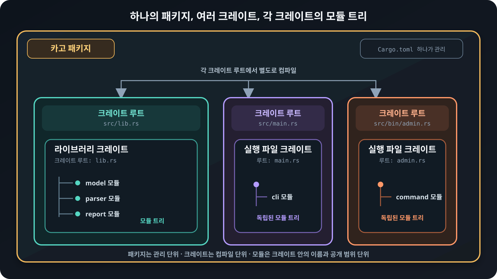

# 패키지, 크레이트와 모듈

Rust 프로젝트의 구조를 읽으려면 패키지, 크레이트, 크레이트 루트, 모듈이 각각
무엇을 뜻하는지 먼저 구분해야 합니다. 이 용어들은 같은 코드를 서로 다른 크기로
바라봅니다.

## 기본 용어

| 용어 | 뜻 |
|---|---|
| 카고<sub>Cargo</sub> 패키지<sub>package</sub> | `Cargo.toml` 하나로 빌드 방법과 의존성을 관리하는 프로젝트 단위입니다. |
| 크레이트<sub>crate</sub> | Rust 컴파일러가 한 번에 처리하는 코드 단위입니다. |
| 크레이트 루트<sub>crate root</sub> | 컴파일러가 크레이트를 처리하기 시작하는 소스 파일이자 모듈 트리의 최상위 모듈입니다. |
| 모듈<sub>module</sub> | 크레이트 안에서 항목을 묶고 이름과 공개 범위를 정하는 단위입니다. |

패키지 하나에는 라이브러리<sub>library</sub> 크레이트가 최대 하나 있고, 직접
실행할 수 있는 실행 파일 크레이트는 여러 개 있을 수 있습니다. 각 크레이트는
자신만의 크레이트 루트와 모듈 트리를 가집니다.

## 단위의 포함 관계

<figure>
  
  <figcaption>패키지는 여러 크레이트를 관리하고, 모듈은 각 크레이트 안에서 트리를 이룹니다.</figcaption>
</figure>

## 파일에서 크레이트 루트 찾기

다음 패키지는 라이브러리 크레이트 하나와 실행 파일 크레이트 세 개를 가집니다.

```text
sample/
├── Cargo.toml
└── src/
    ├── lib.rs          # 라이브러리 크레이트의 루트
    ├── main.rs         # 기본 실행 파일 크레이트의 루트
    └── bin/
        ├── admin.rs    # admin 실행 파일 크레이트의 루트
        └── worker.rs   # worker 실행 파일 크레이트의 루트
```

별도 설정이 없으면 카고는 `src/lib.rs`와 `src/main.rs`를 각 크레이트의 루트로
찾습니다. `src/bin` 바로 아래의 Rust 소스 파일도 각각 별도 실행 파일 크레이트의
루트가 됩니다. 실행할 파일은 `--bin`으로 고릅니다.

```bash
cargo run --bin admin
cargo run --bin worker
```

코드가 많으면 `src/bin/admin.rs` 대신 디렉터리 형태를 사용할 수도 있습니다.

```text
src/bin/admin/
├── main.rs         # admin 실행 파일 크레이트의 루트
└── helper.rs       # admin 크레이트의 하위 모듈 코드
```

`helper.rs`는 자동으로 별도 크레이트가 되지 않습니다. `main.rs`에서
`mod helper;`로 연결해야 `admin` 크레이트의 모듈 트리에 포함됩니다. 여러 실행
파일이 함께 사용할 코드는 보통 `src/lib.rs`의 라이브러리 크레이트에 두고 공개
API로 가져옵니다.

패키지 이름에 하이픈이 있으면 Rust 코드에서 라이브러리 크레이트를 가져올 때는
보통 밑줄로 바꾼 이름을 씁니다. 예를 들어 `rust-course-modules-crates` 패키지의
라이브러리 크레이트는 `rust_course_modules_crates`로 가져옵니다.

> **참고: 카고가 부르는 타깃**
>
> 카고 문서와 명령에서는 라이브러리·실행 파일·예제·테스트처럼 빌드할 항목을
> 타깃<sub>target</sub>이라고 부릅니다. `cargo run --bin admin`은 `admin` 실행
> 파일 타깃을 고르고, `--all-targets`는 패키지의 모든 타깃을 검사합니다. 이
> 강의에서는 타깃의 세부 분류보다 각 시작 파일이 별도 크레이트의 루트가 된다는
> 점에 집중합니다.
