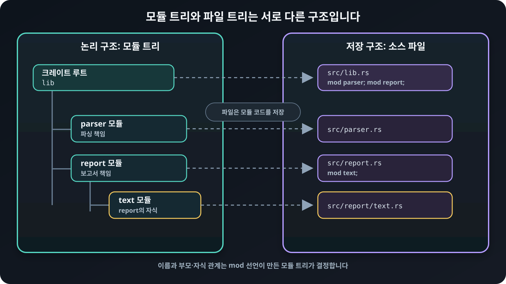

# 모듈 트리와 파일 배치

`mod` 선언은 모듈<sub>module</sub>을 만들고 크레이트<sub>crate</sub>의 모듈 트리에
연결합니다. 다음처럼 중괄호 안에 모듈의 코드를 바로 작성할 수 있습니다.

## 현재 파일에 인라인으로 선언하기

```rust
{{#include ../../../examples/01_modules.rs:inline}}
```

## 모듈 코드를 둘 수 있는 세 위치

모듈 선언 문법은 코드를 중괄호 안에 쓰는 형태와 `mod parser;`처럼 이름만 쓰는
형태로 나뉩니다. 모듈의 실제 코드는 다음 세 위치 가운데 하나에 둘 수 있습니다.

| 코드 위치 | `src/lib.rs`의 선언 | `parser` 모듈의 코드 |
|---|---|---|
| 현재 파일 안 | `mod parser { ... }` | 중괄호 안에 바로 작성합니다. |
| 모듈 이름과 같은 파일 | `mod parser;` | `src/parser.rs`에 작성합니다. |
| 모듈 이름과 같은 디렉터리(예전 방식) | `mod parser;` | `src/parser/mod.rs`에 작성합니다. |

`mod parser;`만 보고는 `parser.rs`와 `parser/mod.rs` 가운데 어느 형태인지 알 수
없습니다. 컴파일러는 두 위치를 후보로 확인하며, 두 파일이 모두 있으면 어느 쪽을
사용할지 결정할 수 없으므로 컴파일 오류가 발생합니다.

`parser/mod.rs` 배치는 현재도 정식으로 지원되며 동작에 문제가 있는 것은
아닙니다. 다만 Rust 2018 이전에 자식 모듈을 파일로 나눌 때 주로 사용하던 예전
방식입니다. Rust 2018부터는 `parser.rs`에 부모 모듈의 코드를 두고
`parser/하위모듈.rs`에 자식 모듈의 코드를 둘 수 있습니다. 새 코드를 작성할 때는
파일 이름만 보아도 모듈 이름을 알 수 있는 `parser.rs` 형태를 우선 사용합니다.
기존 프로젝트가 `parser/mod.rs`를 사용하고 있다면 동작을 바꾸기 위해 굳이
옮길 필요는 없습니다.

## 모듈 안에 모듈 선언하기

모듈 안에서도 `mod`로 다른 모듈을 선언할 수 있습니다. 바깥 모듈은 부모
모듈<sub>parent module</sub>이 되고, 그 안에 선언한 모듈은 자식
모듈<sub>child module</sub>이 됩니다. 다음 코드의 `render_title`은
`report::text::render_title` 경로로 찾습니다.

```rust
{{#include ../../../examples/01_modules.rs:nested}}
```

## 모듈 트리와 파일 연결하기

<figure>
  
  <figcaption>모듈 트리는 코드의 이름과 부모·자식 관계를 나타내고, 파일은 각 모듈의 코드를 저장합니다.</figcaption>
</figure>

모듈이 커지면 코드를 별도 파일로 옮길 수 있습니다. `mod parser;`는 `parser.rs`의
내용을 문자 그대로 끼워 넣는다는 뜻이 아닙니다. 그 파일에 정의된 항목을
`parser` 모듈 아래에 둡니다. 파일 시스템은 모듈을 정리하는 수단이며, 실제 이름과
공개 범위는 모듈 트리가 결정합니다.

위 도식은 `report` 모듈의 코드를 `report.rs`에 두고, 자식인 `text` 모듈의 코드를
`report/text.rs`에 둔 형태입니다. `report.rs`를 `report/mod.rs`로 바꾸더라도 논리
경로는 그대로 `report::text`입니다. 어느 파일 배치를 선택해도 모듈 트리의
이름이나 공개 범위가 자동으로 달라지지는 않습니다.
