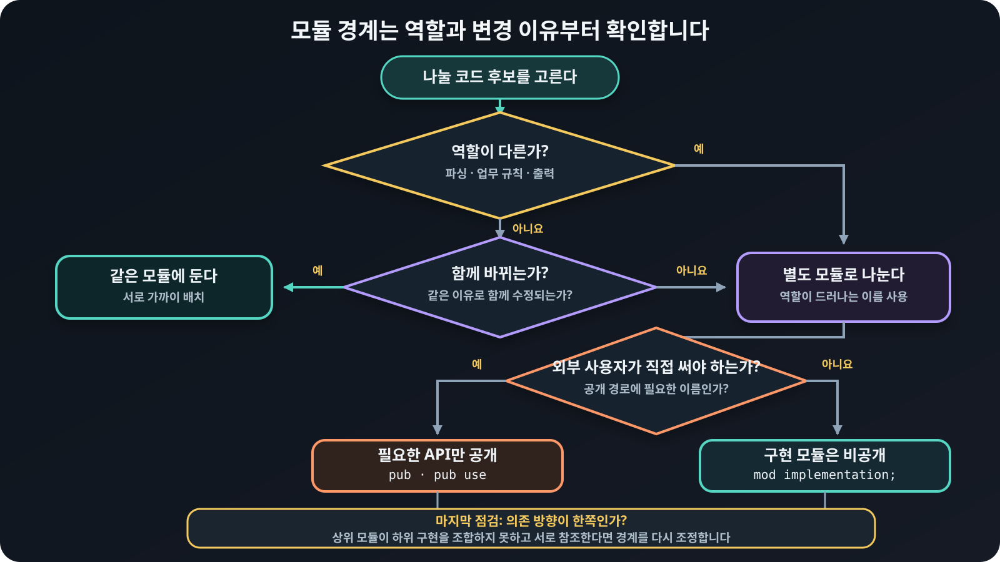

# 모듈을 나누는 기준

## 모듈을 나누는 이유

작은 프로그램은 코드를 한 모듈module에 두어도 충분합니다. 모듈을
나눈다고 실행 속도가 빨라지는 것도 아닙니다. 그러나 코드의 역할이 늘어나면 모든
코드를 한곳에 둔 구조는 변경해야 할 범위와 각 코드의 책임을 파악하기 어렵게
만듭니다.

예를 들어 작업 데이터, 문자열 파싱, 보고서 출력을 모두 `lib.rs`에 두면 다음
문제가 생깁니다.

- 파싱 방식을 바꿀 때 함께 살펴봐야 할 코드의 범위가 분명하지 않습니다.
- 서로 다른 역할의 타입과 함수가 한곳에 섞여 이름을 정하기 어려워집니다.
- 외부에 공개할 이름과 내부에서만 쓸 구현을 구분하기 어려워집니다.
- 변경 내용을 검토하거나 한 역할을 다른 크레이트로 옮길 때 관련 코드를 가려내기
  어렵습니다.

모듈을 나누는 목적은 파일을 작게 만드는 것이 아닙니다. 함께 바뀌는 코드는 모으고,
서로 다른 이유로 바뀌는 코드는 분리해 변경 범위와 책임을 드러내는 것이 목적입니다.

## 경계를 정하는 기준

모듈은 다음 기준으로 나누면 좋습니다.

- 함께 바뀌는 타입과 함수를 가까이 둡니다.
- 파싱, 업무 규칙, 출력처럼 역할이 다른 코드를 분리합니다.
- 외부 사용자가 알아야 할 이름과 내부 구현 이름을 구분합니다.
- 한 방향의 의존 관계가 생기도록 상위 모듈이 하위 구현을 조합합니다.

`utils`, `common`, `misc`처럼 무엇이든 들어갈 수 있는 이름은 책임이 흐려졌다는
신호일 수 있습니다. 파일 크기보다 모듈 이름으로 그 안의 코드가 왜 함께 있는지
설명할 수 있는지를 확인합니다.

## 모듈 경계 결정하기

<figure>
  
  <figcaption>역할과 변경 이유로 경계를 정한 뒤 공개 범위와 의존 방향을 차례로 점검합니다.</figcaption>
</figure>
