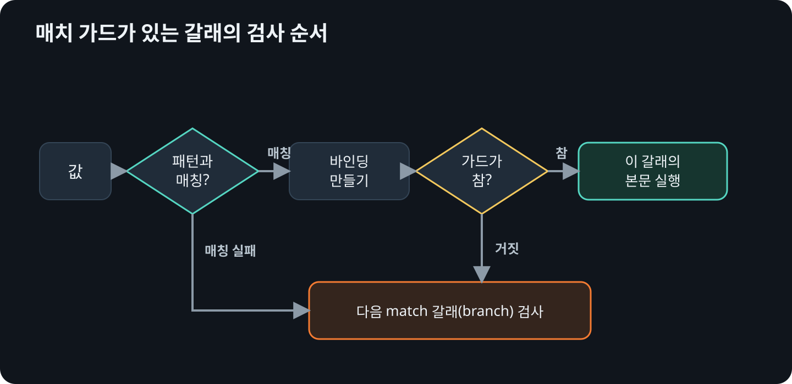

# 매치 가드와 `@` 바인딩

매치 가드<sub>match guard</sub>는 패턴만으로 나타내기 어려운 조건을 불리언 식으로
확인합니다. 먼저 패턴이 매칭<sub>matching</sub>되어 바인딩이 만들어진 뒤 가드에 있는 조건을
평가합니다.

```rust
{{#rustdoc ../../../examples/06_guards_at.rs body=relation}}
```

가드가 있는 갈래<sub>branch</sub>만으로는 컴파일러가 가능한 값을 모두 처리했다고
판단하지 않습니다. 가드의 결과는 실행 중에 정해질 수 있으므로 가드의 조건이 거짓일 때
이어질 갈래가 필요합니다.

## 가드가 있는 갈래의 검사 순서

<figure>
  
  <figcaption>패턴이 매칭되지 않거나 가드가 거짓이면 다음 갈래를 검사합니다.</figcaption>
</figure>

## 겹치는 갈래의 순서

`match` 갈래는 위에서 아래로 검사하므로 서로 겹치는 조건의 순서가 결과를
바꿉니다. 넓은 조건을 먼저 쓰면 아래의 세부 조건이 실행되지 않을 수 있습니다.

## 검사한 값을 다시 쓰기

`@`는 오른쪽 패턴으로 값을 확인하면서 그 패턴과 매칭된 전체 값에
왼쪽에 적은 이름을 붙입니다. 검사한 값을 갈래의 본문에서 다시 사용하려고 같은 조건을 반복할 필요가
없습니다.

```rust
{{#rustdoc ../../../examples/06_guards_at.rs body=digit}}
```

## 패턴 조합하기

구조 분해·범위·OR 패턴·`@` 바인딩·매치 가드는 한 갈래 안에서도 함께 사용할 수
있습니다.

먼저 이동 좌표나 문자열을 담는 열거형을 선언합니다.

```rust
{{#rustdoc ../../../examples/06_guards_at.rs item=Message}}
```

## 조합한 패턴으로 이동 분류하기

```rust
{{#rustdoc ../../../examples/06_guards_at.rs body=describe}}
```

첫 번째 갈래는 바깥의 `Message::Move { ... }`로 열거형을 구조 분해합니다. `x`는
`1..=9` 범위와 매칭되는지 검사하면서 같은 값을 `x`에 바인딩하고, `y`는 `y @ (0 | 1)`로
두 값 가운데 하나인지 검사하면서 실제 좌표도 바인딩합니다. 이 패턴이 모두 매칭된 뒤에는 가드가
`x`가 홀수인지 추가로 확인합니다.

첫 번째 갈래와 매칭되지 않은 `Move` 값은 그 아래의 `Message::Move { x, y }`가
처리합니다. 여러 조건을 조합할수록 구체적인 갈래를 넓은 갈래보다 먼저 두어야
합니다.
