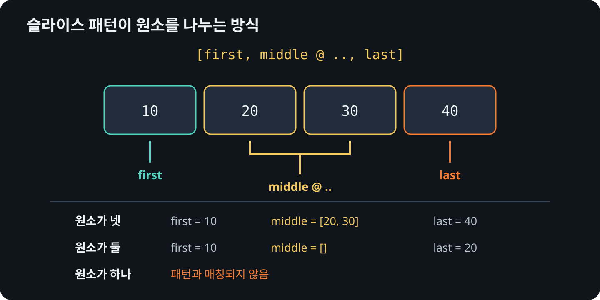

# 슬라이스 패턴

슬라이스 패턴<sub>slice pattern</sub>은 길이와 원소 배치를 함께 확인합니다.
`["add", name]`은 첫 원소가 `"add"`이고 전체 길이가 정확히 2일 때만
매칭<sub>matching</sub>됩니다.

```rust
{{#rustdoc ../../../examples/07_slices.rs body=command}}
```

## 나머지 구간 바인딩

`..`는 개수가 정해지지 않은 연속 구간과 매칭됩니다. 여기에 `@`를 붙인
`[first, middle @ .., last]`는 앞뒤 원소와 가운데 슬라이스를 모두 바인딩합니다.

```rust
{{#rustdoc ../../../examples/07_slices.rs item=split_edges}}
```

`values`는 길이가 타입에 포함되지 않는 `&[i32]`입니다. 원소가 둘 미만이면
첫 번째 패턴에 매칭되지 않으므로 `_` 갈래에서 `None`을 반환합니다. `first`와 `last`는 `&i32`,
`middle`은 `&[i32]`이며 원본을 빌립니다.

## 원소 수에 따른 결과

<figure>
  
  <figcaption>나머지 구간은 비어 있을 수 있지만 앞뒤 원소는 각각 필요합니다.</figcaption>
</figure>

## 패턴에 매칭되는 최소 길이

원소가 하나뿐이면 같은 원소를 `first`와 `last`에 동시에 바인딩할 수 없으므로 이
패턴과 매칭되지 않습니다. 원소가 둘이면 `middle`은 빈 슬라이스가 됩니다.

```rust
{{#rustdoc ../../../examples/07_slices.rs body=lengths}}
```

## 나머지 구간의 위치 바꾸기

`..`는 슬라이스 패턴의 앞·중간·뒤에 쓸 수 있습니다. 다음 예제는 같은 슬라이스를
세 가지 패턴으로 나누어 각 구간을 바인딩합니다.

```rust
{{#rustdoc ../../../examples/07_slices.rs body=rest_positions}}
```

`[first, rest @ ..]`는 첫 원소 뒤의 구간을, `[rest @ .., last]`는 마지막 원소
앞의 구간을 `rest`에 바인딩합니다. `[first, middle @ .., last]`는 앞뒤 원소
사이의 구간을 `middle`에 바인딩합니다.

`first`와 `last`는 각각 첫 원소와 마지막 원소의 참조입니다.
`first_and_rest`는 첫 원소와 그 뒤 구간을 담은 `Some((first, rest))`이고,
`rest_and_last`는 마지막 원소 앞의 구간과 마지막 원소를 담은 `Some((rest, last))`입니다.
입력이 빈 슬라이스라면 두 결과 모두 `None`이 됩니다.

구간을 사용하지 않는다면 `rest @ ..`나
`middle @ ..` 대신 `..`만 쓰면 됩니다.

나머지 구간은 비어 있어도 되지만, 하나의 슬라이스 패턴 안에서 `..`는 한 번만
쓸 수 있습니다.

## 배열을 분해할 때의 차이

길이가 4인 배열은 원소가 둘 이상임을 컴파일할 때 알 수 있으므로 일반 `let`으로
분해할 수 있습니다. 이때 가운데 부분도 길이가 2인 배열 참조 `&[i32; 2]`입니다.
슬라이스의 가운데 부분 `&[i32]`와 타입이 다르다는 점을 확인하세요.

```rust
{{#rustdoc ../../../examples/07_slices.rs body=array}}
```

## 입력 형식에 맞게 사용하기

슬라이스 패턴은 명령줄 인자, 토큰 목록처럼 위치에 의미가 있는 입력에 쓰기 좋습니다. 하지만 입력 형식이
복잡하거나 선택 필드가 많다면 전용 파서로 분리하는 편이 나을 수 있습니다.
