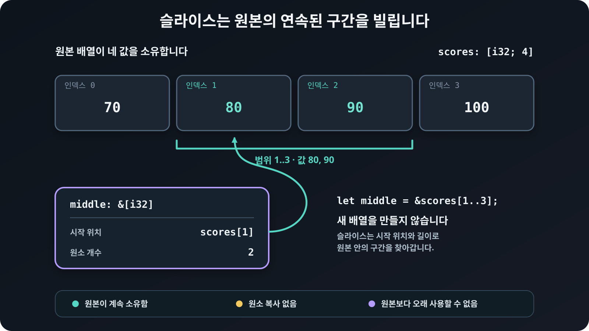
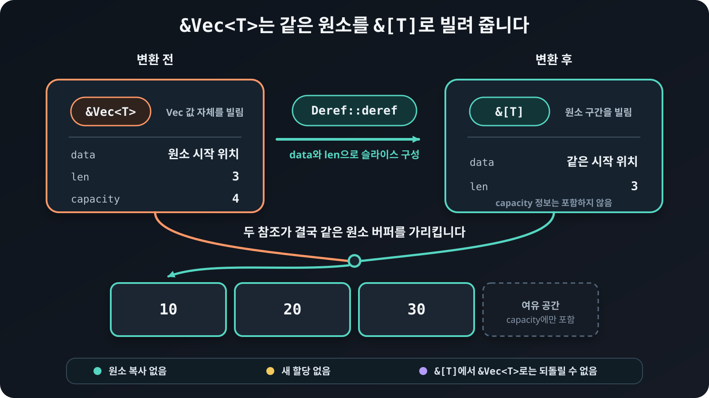

# 슬라이스 복습

문자열을 다룰 때 자주 쓰는 `String`과 `&str`의 차이를 이해하려면 소유한 연속 데이터와 그 일부를 빌리는
참조의 관계를 먼저 알아야 합니다. 그래서 문자열을 살펴보기 전에 배열과
`Vec<T>`를 이용해 일반적인 슬라이스를 복습합니다.

슬라이스<sub>slice</sub>는 배열이나 `Vec<T>`처럼 연속해서 저장된 값의 전체 또는
일부를 빌립니다. 원소를 새 컬렉션으로 복사하지 않고, 시작 위치와 원소 개수로
구간을 나타냅니다.

## 연속된 구간 빌리기

`[T]`는 원소 타입이 `T`인 슬라이스입니다. 길이가 타입에 들어 있지 않으므로
`[T]`를 변수에 직접 저장하지 않고, 보통 공유 참조 `&[T]`나 가변 참조
`&mut [T]`로 사용합니다.

```rust
{{#include ../../../examples/00_slice_review.rs:range}}
```

<figure>
  
  <figcaption><code>&scores[1..3]</code>은 원소를 복사하지 않고 값 80과 90이 있는 구간을 빌립니다.</figcaption>
</figure>

범위 `1..3`은 인덱스 1부터 3 직전까지를 뜻합니다. `middle`은 `scores`의 두
원소를 빌릴 뿐이므로 원본 배열은 그대로 값을 소유합니다. 원본보다 오래
슬라이스를 사용할 수 없으며, 슬라이스를 사용하는 동안에는 원본을 빌림 규칙에
어긋나는 방식으로 바꿀 수 없습니다.

| 타입 | 하는 일 |
|---|---|
| `[T; N]` | `N`개 원소를 직접 소유하는 배열 |
| `Vec<T>` | 실행 중에 길이를 바꿀 수 있는 소유 컬렉션 |
| `&[T]` | 연속된 원소를 공유하여 빌린 슬라이스 |
| `&mut [T]` | 연속된 원소를 독점하여 빌린 가변 슬라이스 |

## 함수 파라미터를 슬라이스로 받는 장점

함수가 원소를 읽기만 한다면 `&Vec<T>`보다 `&[T]`를 받는 편이 알맞습니다.
슬라이스를 받는 함수에는 배열 전체, `Vec<T>` 전체, 두 값의 일부 구간을 모두
넘길 수 있습니다.

```rust
{{#include ../../../examples/00_slice_review.rs:sum}}

{{#include ../../../examples/00_slice_review.rs:parameter}}
```

`sum`은 파라미터로 받은 원소가 배열과 `Vec<T>` 가운데 어디에 저장되었는지 상관없이 처리할 수 있습니다.
만약 콕집어서 `&Vec<T>`를 받도록 정했다면 배열이나 슬라이스를 바로 넘길 수 없어
함수가 처리할 수 있는 입력값이 제한됩니다.

## (참고) `&Vec<T>`가 `&[T]`로 바뀌는 과정

`&Vec<T>`와 `&[T]`는 같은 타입이 아닙니다. `&Vec<T>`는 길이와 용량을 관리하는
`Vec<T>` 값 자체를 가리키고, `&[T]`는 첫 원소의 위치와 원소 개수로 연속된
구간을 가리킵니다.

그럼에도 위에서 슬라이스 파라미터로 전달할 수 있었던 이유는 `Vec<T>`는 역참조 연산의 대상을 `[T]`로 정하는 `Deref<Target = [T]>`를
구현했기 때문입니다. 컴파일러가 `&[T]`를 요구하는 자리에서 `&Vec<T>`를 만나면 이 구현을
사용해 `Vec<T>`가 가진 원소 전체를 슬라이스로 빌립니다. 이를 역참조 강제
변환<sub>deref coercion</sub>이라고 합니다.

<figure>
  
  <figcaption><code>Deref::deref</code>는 원소를 옮기지 않고 <code>Vec&lt;T&gt;</code>의 초기화된 원소 전체를 <code>&amp;[T]</code>로 빌립니다.</figcaption>
</figure>

앞의 예제에서 `vector_reference`의 타입은 `&Vec<i32>`이지만,
`slice_reference`에 대입할 때 `&[i32]`로 강제 변환됩니다. 원소를 복사하거나 새로
할당하지 않고 같은 원소를 다른 참조 타입으로 바라봅니다. `sum(&dynamic)`을 호출할
때도 같은 변환이 일어납니다. 반면 `sum(&fixed)`에서는 배열 참조가 슬라이스
참조로 바뀌는 배열-슬라이스 강제 변환이 일어납니다.

반대 방향인 `&[T]`에서 `&Vec<T>`로의 변환은 일어나지 않습니다. 슬라이스는
배열에서 빌렸을 수도 있고 `Vec<T>`의 일부만 빌렸을 수도 있으며, `Vec<T>`가
관리하는 용량 정보도 알지 못하기 때문입니다.

## 빌린 원소 바꾸기

원소를 바꾸어야 한다면 `&mut [T]`를 받을 수 있습니다. 가변 슬라이스로는 빌린
구간의 원소를 바꿀 수 있지만, 원본 `Vec<T>`에 원소를 추가하거나 제거할 수는
없습니다.

```rust
{{#include ../../../examples/00_slice_review.rs:mutable}}
```

`double`은 배열의 일부만 빌려서 그 구간의 원소를 두 배로 바꿉니다. 가변
슬라이스가 유효한 동안에는 같은 원소를 다른 참조로 동시에 빌릴 수 없습니다.

## 문자열 슬라이스로 이어가기

`Vec<T>`가 원소를 소유하고 `&[T]`가 그 원소의 연속된 구간을 빌리는 것처럼,
`String`은 UTF-8 문자열을 소유하고 `&str`은 문자열의 연속된 구간을 빌립니다.
다만 `&str`은 아무 바이트에서나 나눌 수 없고 UTF-8 문자 경계를 지켜야 합니다.
이제 다음 장에서 `String`·`&String`·`&str`의 차이를 자세히 살펴봅니다.
