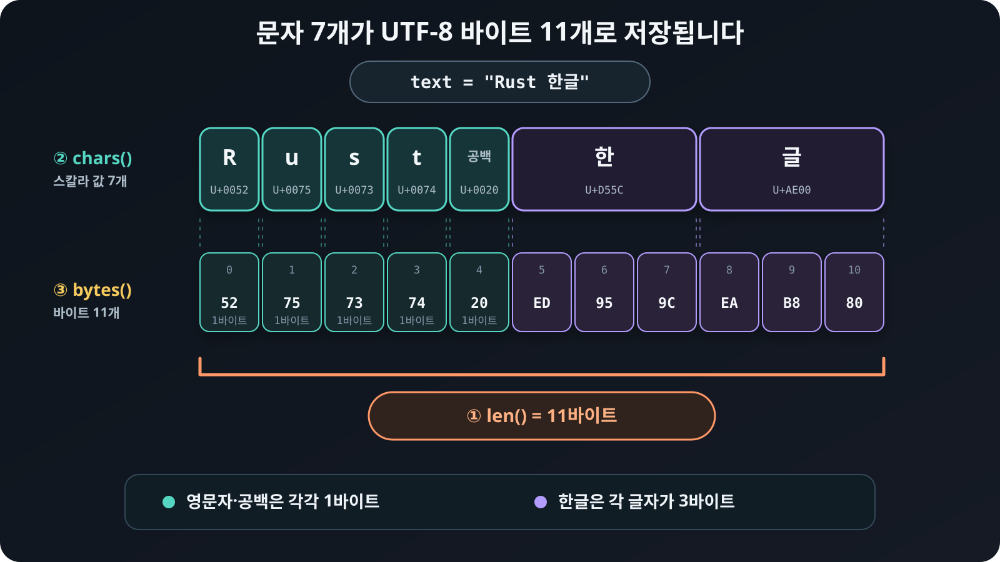

# UTF-8, 문자와 바이트

Rust 문자열은 유니코드를 UTF-8로 인코딩해서 사용합니다. 같은 문자열도 어떻게 세는지에 따라 길이가 다릅니다.

```rust
{{#include ../../../examples/02_utf8.rs:lengths}}
```

<figure>
  
  <figcaption><code>chars()</code>는 유니코드 스칼라 값을 순회하고, <code>bytes()</code>와 <code>len()</code>은 UTF-8 바이트를 기준으로 동작합니다.</figcaption>
</figure>

① `len()`은 바이트 수를 반환합니다. ② `chars()`는 유니코드 스칼라 값을
순회하고, ③ `bytes()`는 저장된 바이트를 순회합니다. 화면에서 한 글자로 보이는 값이 여러
유니코드 스칼라 값으로 이루어질 수도 있으므로 `chars().count()`가 언제나
사용자에게 보이는 글자 수와 같지는 않습니다.

## 문자열과 UTF-8 바이트 변환하기

문자열의 바이트를 빌려서 읽을 때는 `as_bytes`를 사용합니다. 소유한 `String`을
바이트 벡터로 바꿀 때는 `into_bytes`를 사용합니다.

```rust
{{#include ../../../examples/02_utf8.rs:byte_conversion}}
```

`into_bytes`는 원래 `String`을 소비하고 `Vec<u8>`을 반환합니다. 반대로
`String::from_utf8`은 바이트 벡터가 올바른 UTF-8인지 검사한 뒤 `String`으로
바꿉니다. 올바르지 않은 바이트가 들어 있으면 `Err`를 반환합니다. 바이트 슬라이스를
소유하지 않고 문자열 슬라이스로 빌리려면 `str::from_utf8`을 사용할 수 있습니다.

문자열에는 `text[0]` 같은 정수 인덱싱이 없습니다. 정수 하나만으로는 첫 바이트,
첫 유니코드 스칼라 값, 첫 화면 글자 가운데 무엇을 뜻하는지 정할 수 없기
때문입니다.

```rust
{{#include ../../../examples/02_utf8.rs:safe_slice}}
```

바이트 범위로 슬라이스할 때는 양 끝이 UTF-8 문자 경계여야 합니다. 외부 입력으로
범위를 받는다면 `get`으로 확인하는 편이 안전합니다.
