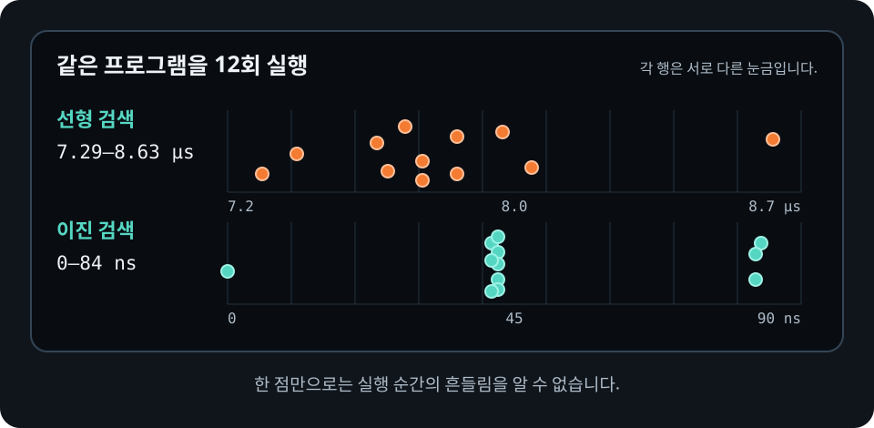

# 벤치마크 전에 확인할 것

성능을 개선하기 전에 프로그램이 올바른지 테스트로 확인해야 합니다. 서로 다른
결과를 만드는 두 구현의 실행 시간은 공정하게 비교할 수 없습니다.

벤치마크에서는 다음 조건을 확인하세요.

- `--release` 최적화가 적용된 코드끼리 비교합니다.
- 같은 입력과 같은 결과를 사용하는지 확인합니다.
- 준비 작업과 측정할 작업을 구분합니다.
- 짧은 준비 실행으로 코드와 데이터를 측정 직전의 상태에 가깝게 만듭니다.
- 한 번 잰 시간이 아니라 여러 번 반복한 결과를 봅니다.
- 컴파일러가 계산 전체를 없애지 않도록 결과와 입력에 `black_box`를 사용합니다.
- 항상 같은 구현을 먼저 재면 실행 순서가 결과에 영향을 줄 수 있음을 확인합니다.
- 다른 프로그램의 부하, CPU 절전과 발열이 결과에 영향을 줄 수 있음을 기억합니다.

다음 예제는 `Instant`로 한 번 측정하는 방법을 보여 줍니다.

```rust
{{#include ../../../examples/03_measure.rs}}
```

```bash
cargo run --release --example 03_measure
```

한 번의 결과는 실행 환경에 쉽게 흔들리므로 최종 성능 근거로 삼지 마세요. 이 예제는
측정 구간과 준비 구간을 나누는 법을 익히기 위한 출발점입니다. 선형 검색을 항상
먼저 실행하므로 실행 순서의 영향도 분리하지 못합니다.

<figure>
  
  <figcaption>같은 실행 파일도 실행 순간에 따라 값이 달라집니다. 한 점이 아니라 반복한 결과의 분포를 확인하세요.</figcaption>
</figure>
