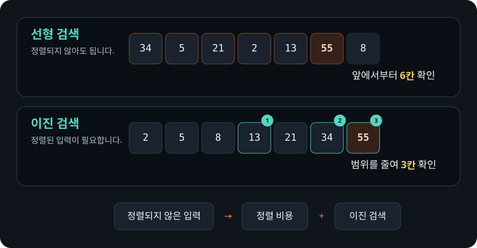

# `cargo bench`로 반복 측정하기

Cargo는 `benches` 디렉터리의 벤치마크 타깃을 최적화해서 실행합니다. 이 강의에서는
별도 라이브러리 없이 안정 Rust에서 실행할 수 있도록 사용자 정의 실행 파일을
벤치마크 타깃으로 등록했습니다.

```toml
[[bench]]
name = "search"
harness = false
```

벤치마크 코드는 선형 검색과 이진 검색을 같은 입력으로 반복합니다.

```rust
{{#include ../../../benches/search.rs}}
```

다음 명령으로 실행합니다.

```bash
cargo bench --bench search --locked
```

벤치마크를 실행하지 않고 컴파일만 확인할 수도 있습니다.

```bash
cargo bench --no-run --locked
```

실행기는 측정 전에 짧게 준비 실행을 하고, 전체 시간을 반복 횟수로 나눈 회당 시간을
함께 출력합니다. 이 값도 한 프로세스에서 한 구현씩 차례로 잰 결과이므로 실행 순서의
영향, 이상치와 분포까지 설명하지는 못합니다. 여러 번 실행해 결과가 얼마나
흔들리는지 확인하세요.

이 작은 실행기는 학습용입니다. 실행 순서를 섞은 반복 측정, 이상치 분석, 통계와
이전 결과 비교가 필요한 프로젝트에서는 Criterion 같은 전용 벤치마크 라이브러리를
검토하세요. 라이브러리를 도입하더라도 올바른 입력, 측정 구간과 `black_box`를
판단하는 원칙은 같습니다.

## 결과 해석하기

이진 검색이 빠르다는 결과만 보고 모든 코드를 바꾸면 안 됩니다. 이진 검색은 입력이
정렬되어 있어야 합니다. 검색 전에 매번 정렬해야 한다면 정렬 비용까지 포함해서
측정해야 합니다.

`ns/회`는 이 실행기에서 전체 시간을 반복 횟수로 나눈 값입니다. 함수 한 번의 비용을
완벽하게 분리한 값은 아니며 반복문, `black_box`와 시간 측정 방식의 영향도 함께
들어 있습니다. 서로 다른 컴퓨터에서 나온 숫자를 그대로 비교하지 말고 같은 환경과
명령으로 측정한 결과를 비교하세요.

<figure>
  
  <figcaption>검색 횟수만 비교하지 말고, 이진 검색이 요구하는 정렬 비용까지 같은 측정 구간에 포함합니다.</figcaption>
</figure>
