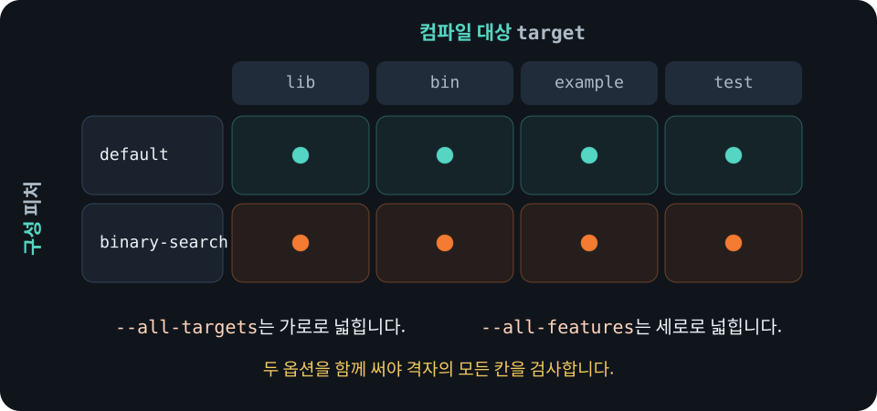

# 카고 피처와 검사 조합

카고<sub>Cargo</sub> 피처<sub>feature</sub>를 사용하면 조건에 따라 코드를
컴파일하거나 필요할 때만 쓰는 의존성을 활성화할 수 있습니다. 이 강의
프로젝트에는 다음 두 피처가 있습니다.

```toml
[features]
default = []
binary-search = []
```

`default`에 아무 항목도 없으므로 별도 옵션 없이 빌드하면 `binary-search`는
비활성화됩니다. 다음 예제는 피처 상태에 따라 서로 다른 검색 함수를
컴파일합니다.

```rust
{{#include ../../../examples/13_features.rs}}
```

두 구성을 각각 실행해 출력 차이를 확인할 수 있습니다.

```bash
cargo run --example 13_features
cargo run --example 13_features --features binary-search
```

피처는 서로 함께 켜져도 동작하도록 추가하는 방식으로 설계하는 편이 좋습니다.
한 피처를 켰을 때 기존 공개 API의 뜻이 달라지거나 다른 피처를 꺼야만
컴파일되는 구조는 사용하는 쪽에서 조합하기 어렵습니다.

## 검사 범위 지정하기

피처 옵션을 지정하지 않으면 기본 피처만 활성화됩니다.

```bash
cargo check
cargo check --features binary-search
cargo check --all-features
cargo check --no-default-features
```

- `--features`는 나열한 피처를 추가로 켭니다.
- `--all-features`는 패키지에 정의된 모든 피처를 켭니다.
- `--no-default-features`는 `default`에 나열한 피처를 끕니다.

`--all-targets`와 `--all-features`는 뜻이 다릅니다. 전자는 라이브러리, 실행 파일,
예제와 테스트 같은 카고 타깃을 넓게 검사합니다. 후자는 조건부 컴파일
구성을 바꿉니다. 모든 타깃을 검사해도 기본값이 아닌 피처의 코드는 빠질 수
있습니다.

`--all-features`도 모든 조건부 코드를 검사한다는 뜻은 아닙니다. 예제의
`#[cfg(not(feature = "binary-search"))]` 분기는 `binary-search`를 켜면 컴파일에서
빠집니다. 따라서 기본 피처를 끈 구성과 모든 피처를 켠 구성에서
클리피<sub>Clippy</sub>와
테스트를 각각 실행해야 두 검색 분기를 모두 확인할 수 있습니다.

<figure>
  
  <figcaption><code>--all-targets</code>와 <code>--all-features</code>는 서로 다른 방향으로 검사 범위를 넓힙니다.</figcaption>
</figure>

## 어떤 조합을 검사할지 정하기

피처가 늘어나면 가능한 조합 수가 빠르게 증가합니다. 모든 조합을 무조건
검사하기보다 프로젝트가 지원한다고 약속한 구성을 정합니다.

1. 사용자가 별도 옵션 없이 쓰는 기본 피처 구성을 검사합니다.
2. 기본 피처를 모두 끈 구성을 지원한다면 `--no-default-features`로 검사합니다.
3. 모든 피처가 함께 켜질 수 있다면 `--all-features`로 검사합니다.
4. `cfg(not(...))`처럼 피처를 켰을 때 빠지는 코드가 있는지 확인합니다.
5. 자주 쓰거나 서로 영향을 주는 조합을 별도로 검사합니다.

이 프로젝트의 `make check`는 기본 구성, 기본 피처를 끈 구성, 모든 피처를 켠
구성을 컴파일하고 테스트합니다. 클리피도 기본 피처를 끈 구성과 모든 피처를 켠
구성에서 각각 실행합니다. 피처가 다른 피처나 선택적 의존성을 켜는 방법과, 여러
경로에서 켜진 피처가 합쳐지는 방식은
[카고 피처 문서](https://doc.rust-lang.org/cargo/reference/features.html)에서
확인할 수 있습니다.
