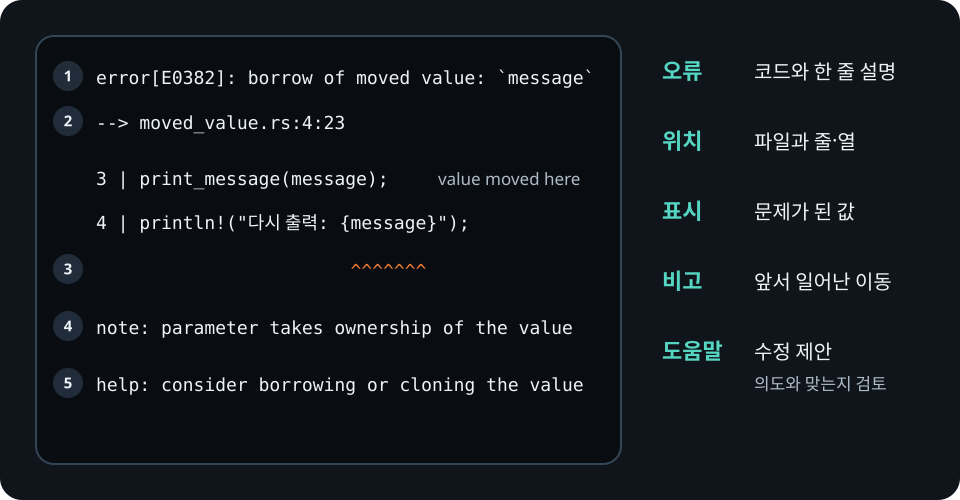

# 컴파일 오류 읽기

Rust 컴파일 오류에는 단순히 실패했다는 사실만 아니라 컴파일러가 확인한 위치,
관련된 값과 가능한 수정 방법이 함께 들어 있습니다. AI에게 바로 수정을 맡기기 전에
오류가 말하는 사실을 직접 분리해서 읽어야 합니다.

## 첫 번째 오류부터 읽기

하나의 잘못된 타입이나 문법 때문에 뒤에서 여러 오류가 연달아 생길 수 있습니다.
출력된 오류 수만큼 서로 다른 문제가 있다고 단정하지 말고 첫 번째 오류부터 고친 뒤
다시 `cargo check`를 실행하세요.

오류 하나는 대체로 다음 순서로 읽습니다.

1. `error[E....]`의 오류 코드와 한 줄 설명을 읽습니다.
2. 화살표가 가리키는 파일과 줄을 찾습니다.
3. 밑줄과 함께 표시된 값이나 타입을 확인합니다.
4. `note`에서 앞선 이동, 빌림이나 타입 결정 위치를 찾습니다.
5. `help`의 제안이 프로그램의 의도와 맞는지 판단합니다.

<figure>
  
  <figcaption>오류 메시지는 위에서 아래로 읽되, 제안은 프로그램의 의도와 맞는지 따로 판단합니다.</figcaption>
</figure>

## 이동한 값을 다시 사용한 예제

다음 파일은 일부러 컴파일되지 않게 작성했습니다.

```rust,compile_fail
{{#include ../../../examples/compile_fail/moved_value.rs}}
```

`print_message`가 `String`을 값으로 받으므로 `message`의 소유권이 함수로 이동합니다.
뒤의 `println!`에서 같은 값을 다시 사용하면 컴파일러는 `E0382`를 보고합니다.

오류 코드의 자세한 설명은 다음 명령으로 읽을 수 있습니다.

```bash
rustc --explain E0382
```

해결책은 하나가 아닙니다. `print_message`가 값을 소유해야 하는지 먼저 결정해야
합니다. 읽기만 하면 된다면 `&str`이나 `&String`을 받도록 바꿀 수 있고, 함수가 값을
보관해야 한다면 호출자가 이후에 사용하지 않도록 설계를 바꾸거나 명시적으로 복제할
수 있습니다. 컴파일러가 `clone`을 제안하더라도 복제가 요구 사항에 맞는지는 사람이
판단해야 합니다.

## AI에게 오류를 전달할 때

오류 한 줄만 떼어 주면 이동이 시작된 위치나 관련 타입 정보가 빠질 수 있습니다.
최소 재현 코드, 실행한 명령, 첫 번째 오류의 전체 내용과 원래 의도를 함께
전달하세요. 받은 수정안은 다음 항목을 다시 확인합니다.

- 불필요한 `clone()`으로 소유권 문제를 덮지 않았는가?
- `unwrap()`이나 `allow`로 다른 오류를 숨기지 않았는가?
- 공개 API나 오류 처리 방식이 달라지지 않았는가?
- 수정 뒤 `cargo check`, Clippy와 테스트가 모두 통과하는가?
