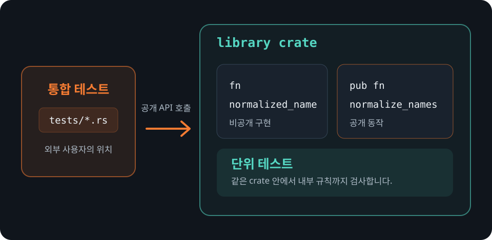

# 단위 테스트와 통합 테스트

Rust에서는 테스트의 위치에 따라 접근할 수 있는 코드와 컴파일 방식이 달라집니다.

## 단위 테스트

단위 테스트는 보통 검사할 코드와 같은 파일의 `#[cfg(test)] mod tests` 안에 둡니다.
`cfg(test)`가 붙은 모듈은 테스트할 때만 컴파일됩니다. 자식 모듈이므로 `super`를
통해 비공개 함수도 검사할 수 있습니다.

이 강의의 `src/lib.rs`에는 이름 하나를 정돈하는 비공개 함수를 검사하는 단위
테스트가 있습니다.

```rust
{{#include ../../../src/lib.rs}}
```

단위 테스트는 작은 계산이나 공개 API를 구성하는 내부 규칙을 빠르게 확인하는 데
알맞습니다. 모든 비공개 함수를 각각 검사해야 한다는 뜻은 아닙니다. 공개 API를
사용해 충분히 확인되는 구현 세부 사항까지 테스트하면 리팩터링할 때 테스트가
불필요하게 깨질 수 있습니다.

## 통합 테스트

프로젝트 루트의 `tests` 디렉터리에 둔 Rust 파일은 각각 별도의 crate로 컴파일됩니다.
따라서 외부 사용자가 라이브러리를 쓰는 것처럼 공개 API만 사용할 수 있습니다.

```rust
{{#include ../../../tests/exercises.rs}}
```

다음 명령은 이름이 `exercises`인 통합 테스트 타깃만 실행합니다.

```bash
cargo test --test exercises
```

<figure>
  
  <figcaption>테스트의 위치가 접근할 수 있는 코드와 지켜야 할 약속을 결정합니다.</figcaption>
</figure>

## 어디에 둘지 결정하기

- 작은 내부 규칙을 직접 확인해야 한다면 같은 파일의 단위 테스트를 사용합니다.
- 공개 API 여러 개를 조합한 사용법을 확인한다면 통합 테스트를 사용합니다.
- 버그가 공개 API로 재현된다면 구현 세부 사항보다 공개 동작을 검사하는 편이
  리팩터링에 강합니다.
